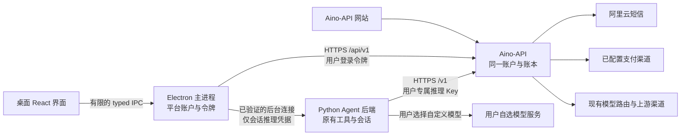
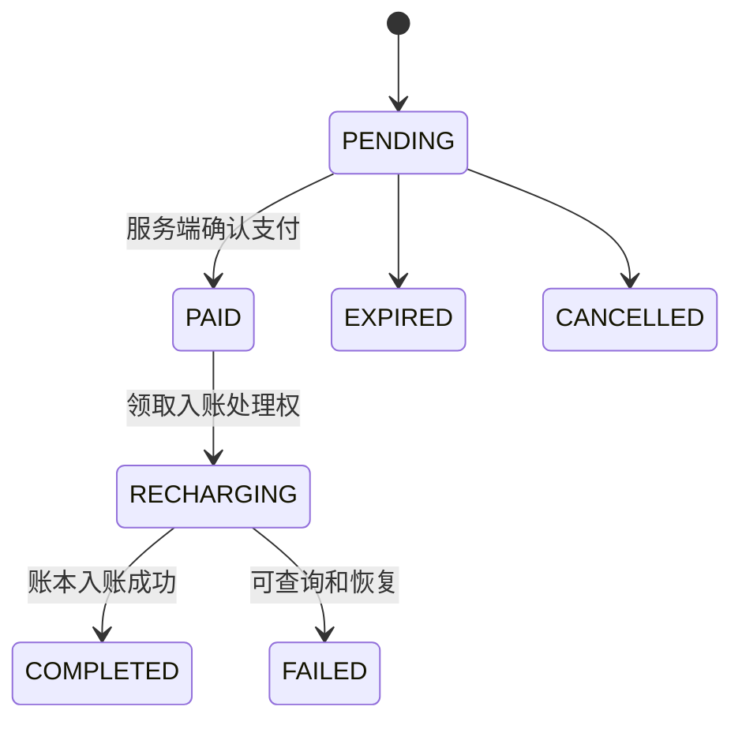

# Aino 统一账户、内置模型与充值：产品及技术方案

日期：2026-09-14。用途：交给 Claude 开发，完成后由 Codex 按证据复核。

本文是待实现的设计，不是功能已经完成的声明。配套执行计划：
[逐项执行计划](/Users/zizimutou/Protect/Aino/docs/aino-platform/implementation-plan.md)。

## 1. 要交付的体验

用户打开 Aino，使用手机号和真实短信验证码登录，即可看到平台提供的模型；账户有可用余额或适用的订阅额度时，选模型就能聊天，不需要自己填写 API 地址和密钥。余额不足时，可以在 Aino 的「我的账户」中充值、查询到账和消费记录。熟悉模型服务的用户仍能使用原有自定义模型。

「登录即可聊」的准确含义是免手工配置，有额度时可直接调用。新用户免费额度取自服务端既有赠送设置；本方案不擅自确定赠送金额、售价或免费模型。

必须同时做到：

1. 桌面端与模型站点使用同一个 `users.id`、同一余额、同一订单与扣费记录。
2. 首选手机号验证码；已有邮箱/第三方登录账户可以绑定手机号，沿用原余额，不重新注册。
3. 保留现有独立的小尺寸原生登录窗口。登录成功先恢复主窗口尺寸再挂载工作区。「我的账户」不是登录页面。
4. 「我的账户」继续位于设置中「模型」上方；左下角姓名/头像取同一账户状态。
5. 内置模型与自定义模型明确分组，首页和已发送会话使用同一模型状态与切换链路。
6. 内置模型按 Aino-API 账本收费；自定义模型按其服务商收费。任何切换、辅助任务、失败恢复都不能暗中跨越这个边界。
7. 保留当前聊天、项目、工作区、Agent Hub、工具审批、终端、摘要、上下文压缩、附件和多窗口行为。

## 2. 已核实的基础与尚未核实的材料

### 2.1 仓库和线上状态

| 对象 | 2026-09-14 核查结果 | 执行时的含义 |
| --- | --- | --- |
| Aino | `/Users/zizimutou/Protect/Aino`；分支 `codex/hide-unsent-session-title`；HEAD `3bb72e32b1b2a83896439587651d73dd9a3d2319`；工作树干净 | 这是含已完成 UI 改动的已知基线，不能盲目从较旧 main 开始覆盖它 |
| Aino-API | `/Users/zizimutou/Protect/Aino-API`；main；HEAD `bdb42e22f81fcb633ff0a060961211dd2bcb515b`；工作树干净 | 两仓库独立分支、独立提交，记录配对 SHA |
| 自有远程 | `https://github.com/Ablankpaper/Aino`、`https://github.com/Ablankpaper/Aino-API` | 不向 NousResearch 或 sub2api 上游推送 |
| 正式服务 | `https://api.agentera.com.cn` | 账户 API 前缀 `/api/v1`；模型 API 前缀 `/v1`，不是整个域名统一加 `/v1` |
| 健康检查 | `/health` 返回 HTTP 200、`status: ok` | 仅说明服务存活 |
| 模型路由 | 无密钥 GET `/v1/models` 返回 HTTP 401、`API_KEY_REQUIRED` | 路由与鉴权存在；尚未验证带密钥推理、工具调用或扣费 |
| 公开设置 | `/api/v1/settings/public` 返回 `version: 0.2.4`、`registration_enabled: false`、`payment_enabled: false`、`site_name: Sub2API` | 开发不能私自打开线上开关；版本字符串不能证明线上部署等于本地 SHA |

以上是一次公开读取的结果，不代表实时监控。未登录管理后台、未检查线上数据库、未发短信、未付款。

### 2.2 短信资源

| 配置 | 核实值 |
| --- | --- |
| 服务 | 阿里云国内短信 |
| 资质 | Aino，ID `3011567`，自用，审核通过 |
| `SignName` | `郑州雾棠`，可用正常；部署录入时以控制台复制的原文为准 |
| `TemplateCode` | `SMS_512380723`，名称 AINO，验证码类型，审核通过、状态正常 |
| 运营商状态 | 移动/联通报备成功；电信「已报备待验证」 |
| 模板正文 | 用户尚未提供；变量名称、变量个数、有效期措辞未确认 |

不得把资质 Aino 或模板名称 AINO 当成 `SignName`；不得拿另两条模板替换本模板。`${code}` 只可以用作本地测试模板示例，不能声称已核对正式变量。

### 2.3 实施不需要等待、上线前必须补齐的材料

| 材料 | 没有时如何推进 | 什么时候必须具备 |
| --- | --- | --- |
| 完整短信模板正文及变量 | 完成配置校验、适配器和假短信服务测试 | 首次真实发短信前 |
| 短信服务端凭据 | 只创建配置入口和示例，不读取用户其他目录找密钥 | 服务端接入阿里云时，使用专用 RAM 身份/角色 |
| 电信签名验证结果 | 完成开发和其他已授权运营商测试，记录未覆盖 | 宣称三网均验收通过前 |
| 正式部署 SHA、部署方式及预发布地址 | 本地使用隔离 PostgreSQL/Redis 和模型/支付测试服务 | 执行服务器发布前 |
| 官方模型分组、模型名单、默认模型、价格、赠送策略 | 测试使用明确标注的 fixture 模型；后台配置默认空且关闭 | 真实「登录即可聊」验收前 |
| 已开通支付渠道和商户配置 | 复用现有支付测试适配器和回调验证 | 真实充值测试及上线前 |
| 可用协议/隐私政策、支持联系入口 | 完成渲染和版本记录机制 | 开放公众注册前 |
| 真实短信接收人、实测金额/次数和环境授权 | 完成所有不依赖真实外部调用的测试 | 发短信、付费模型请求、真实支付或生产操作前 |

材料缺失只阻止依赖它的真实联调，不能把其余任务一并停下，也不能用假数据冒充完成。

## 3. 架构决策

选择「扩展现有 Aino-API，桌面通过专用适配层接入」。另外两种做法分别是另建账户/钱包服务、仅把网页嵌入桌面；前者引入双账本和迁移问题，后者不能满足原生登录与输入框模型选择，所以不采用。



| 责任 | 唯一权威 |
| --- | --- |
| 用户、手机号身份、验证结果、余额、订单、价格、扣费、模型权限 | Aino-API 服务端 |
| 桌面登录令牌、设备安装 ID、账户状态广播、可信连接凭据传递 | Electron 主进程 |
| 会话、Agent 调用、工具、上下文、流式结果、每次请求关联 | 现有 Python 后端 |
| 页面、输入、错误恢复、缓存视图 | React；站点相应页面继续 Vue |

不另建钱包，不把钱包存在 `account.json`，不让 renderer 直接拿管理员 Key 或用户 refresh token，不让模型回答推算账户余额。

商业账户是「平台地址＋用户 ID」作用域，独立于项目、profile、SSH 和远程 Agent 连接。工作区切换只影响 Agent 工作环境。

本次不做聊天云同步、跨设备项目同步、共享电脑的本地文件隔离、多租户云执行环境、新套餐体系或自动充值。现有本地会话属于本机工作区；登录用于平台身份与计费，不得宣传成已提供云同步或操作系统级多用户隔离。

## 4. 账户与短信设计

### 4.1 手机号是已有账户的登录身份

继续使用 `users` 和 `auth_identities`。新增身份：

```json
{"provider_type":"phone","provider_key":"default","provider_subject":"+8613900000000","verified_at":"server timestamp"}
```

该号码仅为格式示例，不用于真实发送。首版支持中国大陆 `+86`；后端统一正规化，接受国内号码、`+86`/`0086` 前缀和常见空格，拒绝多个号码、分隔列表、无效长度及非支持地区。网页和桌面共同读取服务端能力，不各自维护一套有冲突的规则。

保留现有全局唯一 `(provider_type, provider_key, provider_subject)`，再用仅作用于 `phone` 的部分唯一约束保证每个用户至多绑定一个手机号。手机号不能同时属于两个账户。为 `phone` 同步扩展数据库 CHECK、Ent 校验、provider 展示、身份摘要、signup_source 和赠送策略白名单；不能只改一处字符串。软删除用户关联的phone身份默认不自动重分配或重新赠金；找回/重新绑定需另行核实处理，不能把已删账户复活或把手机号转给新账户。

**手机号独立注册的兼容方案：** 当前 `users.email/password_hash` 是必填，已有非邮箱 OAuth 使用内部占位邮箱。因此首版沿用这条经过验证的兼容路线，使用随机 UUID 生成 `UUID@phone.aino.invalid` 和随机不可交付密码的哈希。真实手机号只存于 canonical identity；占位地址不编码手机号，不创建真实 email identity，不允许邮箱密码登录/找回，不用于任何通知，不显示在个人信息、订单或默认昵称中。绑定真实邮箱后复用现有邮箱绑定事务替换占位地址。

采用这一方案是为了避免大规模改动所有必填邮箱消费者。必须审计保留域判断、通知收件人解析、管理员列表和导出、认证 DTO 等实际消费者。用户侧新增 `email_bound`、`phone_bound`、`phone_masked`、`display_name`；未绑定真实邮箱时，对外 `email` 为空字符串以兼容现有 string 类型。

不得直接调用会按「邮箱相同」自动关联用户的旧 OAuth 便捷函数完成手机号绑定。以经验证的 canonical phone identity 查账户；新建用户、身份和一次性赠送记录必须在事务/现有幂等机制内完成。

### 4.2 登录与已有账户绑定

新用户流程：手机号 → 阅读并同意协议 → 获取验证码 → 验证 → 创建或返回账户 → 如账户已有 TOTP 则继续第二因素 → 返回既有格式的 token pair。

验证码页明确「未注册的手机号验证后将创建账户」。同时提供容易发现的「已有站点账户，先绑定手机号」入口，不能让用户在已有余额账户之外无意再注册一份。

已有用户流程：

- 邮箱账户：使用既有邮箱密码与 TOTP 登录，再在同一账户绑定手机号。
- 第三方账户：通过已有网站第三方登录，在网站个人资料绑定手机号，再回桌面短信登录。首版不另建整套 OAuth 授权服务器。
- 绑定使用当前 JWT 的 `user_id`，加同一用户/会话发起的手机验证码；不能根据客户端提交的 `user_id` 或邮箱直接转移余额。
- 手机号被其他账户占用，返回冲突并停止，不自动合并用户、订单或钱包。
- 首次绑定不再次发注册赠金。原有绑定策略中如存在 provider default grants，新增 phone 必须明确排除重复金钱/额度授予。
- 现有封禁、注册开关、邀请码、协议和 TOTP 规则都需走真实公共校验路径。手机号不能绕过 TOTP；只有第二因素完成后才能获得普通账户令牌。
- `registration_enabled=false` 时，已有手机号仍可登录；陌生手机号只有在验证所有权后才返回注册关闭信息，不建用户。

首版包含首次绑定与展示；不新增自助找回丢失手机号和自动合并账户。既有通用解绑入口必须识别 phone，且禁止删除账户唯一可用登录方式；敏感绑定/解绑复用近期认证和现有 step-up 规则，陈旧会话要求重新认证，TOTP 账户要求 TOTP。无需删除原有邮箱/第三方入口。

### 4.3 发码、验证与防重复

推荐默认值是可配置的服务端行为，不是硬编码的正式模板内容：

| 行为 | 默认策略 |
| --- | --- |
| 正式验证码 | `crypto/rand` 生成 6 位数字，允许前导零；若审核模板限制不同，按正式配置校验 |
| 有效期 | 本地测试默认 300 秒；生产必须与模板正文一致，未核对不得宣布就绪 |
| 冷却 | 同一规范手机号跨用途至少 60 秒 |
| 发码上限 | 单号每小时 5 次/每日 10 次；单 IP 每小时 30 次；全站每日 1000 次保护上限，可后台调整 |
| 校验上限 | 每个 challenge 最多 5 次失败；耗尽即作废，不允许刷新 TTL 复活 |
| 请求超时 | 阿里云请求总超时 5 秒；超时不得自动再发一条 |
| 防刷 | 复用既有可信代理 IP 解析和 captcha；captcha 已开启时桌面与网页都必须通过，不允许以桌面标识豁免 |

复用 Redis 客户端、错误/限流模式、邮箱验证码的经验；新建短信专用 challenge 命名空间，不能让邮箱码、登录码、绑定码互通。使用 `challenge_id` 随机不可猜；记录规范手机号摘要、用途、发起用户/认证会话（绑定场景）、过期时间、失败次数和状态。

验证码校验材料使用带服务端 secret 的 HMAC；不能仅保存短验证码的无盐 hash。运营日志仅记脱敏号码、request/BizId、错误码、耗时和状态；不记录验证码、完整响应令牌、AccessKey 或手机号明文日志。

Redis Lua/事务原子完成次数限制、状态改变与一次性消费；跨多个 API 实例也只能成功一次。成功校验产生仅供当前请求使用、用途绑定的内存证明，再由账户事务完成操作；事务失败不恢复已消费的码，用户重新获取验证码登录。若前次事务实际已提交，canonical identity 与赠送唯一性保证再次登录不会重复建人/送额度。验证码正确不等于已经建好账户。

发码状态区分 `sending`、`submitted`、`failed`、`unknown`。阿里云 `Code=OK` 表示受理，不冒充已送达；超时记录 `unknown` 和冷却，有回执可查时查询回执。Redis 不可用时 fail closed，返回可重试服务错误，不能退回单进程内存限制。服务端计数要原子且 TTL 可靠。

`1234` 只属于显式本地开发模式：API 开发配置＋本地/测试运行条件共同控制；面向正式域名的桌面永远走真实短信。不能因 `npm run dev` 就允许向线上用固定码登录；生产即使误设一个 dev 标志，也必须启动拒绝或关闭测试认证。

### 4.4 阿里云配置与后台入口

Aino-API 新增短信设置小节，复用现有管理员 settings、权限、审计、脱敏保存流程。非秘密配置为启用、签名、模板编号、变量映射、有效期、限流与预算；凭据只从服务端安全配置注入，后台只显示已配置状态，不返回原值。验证码 HMAC 密钥也在服务端安全配置管理，多实例共享。

使用阿里云官方 Dysmsapi SDK，服务端调用 `SendSms`。变量映射必须覆盖审核模板的全部变量，例如验证码、有效期；未知变量、缺失凭据、签名空值或正式模板未核对时，公开能力返回不可用及恢复提示。不要在前端打包 AccessKey，不手写一套签名算法。

短信配置变更、发码被限流、失败与验证码攻击只记录必要业务审计。后台测试发送必须由管理员明确输入接收人并点击，不能页面加载就发送。

## 5. API 契约

以下标为新增的路由是本方案约定，当前尚不存在。正式 JSON envelope、错误结构和状态码复用 Aino-API 现有 `response`/`infraerrors`，不能另起不兼容外层。字段支持新增，不破坏旧站点客户端。

### 5.1 账户与身份

| 路由 | 状态 | 输入/输出与约束 |
| --- | --- | --- |
| `GET /api/v1/settings/public` | 扩展 | 新增 `phone_login_enabled`、`phone_registration_enabled`、`phone_binding_enabled`、`phone_regions`、`phone_code_length`、`desktop_api_version: 1`、正式协议版本/URL；不含秘密 |
| `POST /api/v1/auth/phone/send-code` | 新增 | 输入 `phone`、既有 captcha proof；输出 `challenge_id`、`expires_in`、`retry_after`、`delivery`；发码时不泄露手机号是否已注册 |
| `POST /api/v1/auth/phone/verify` | 新增 | 输入 `phone`、`challenge_id`、`code`、`register_if_new`、`agreement_revision`，注册政策要求的邀请/推广参数沿用现有语义 |
| `POST /api/v1/auth/login`、`/auth/login/2fa` | 复用 | 邮箱账户登录；手机号命中 TOTP 时也复用既有临时登录挑战/第二因素完成逻辑 |
| `POST /api/v1/auth/refresh`、`/auth/logout` | 复用并接入托管凭据撤销 | token pair 格式不重造；并发 refresh rotation 与 session family 语义保持 |
| `GET /api/v1/user/profile`、`PUT /api/v1/user` | 扩展/复用 | 增补电话身份摘要；昵称用既有 username 更新路径，桌面校验继续 1–32 字符 |
| `POST /api/v1/user/account-bindings/phone/send-code` | 新增，需用户登录及近期认证 | 输入 `phone`；challenge 绑定当前主体和认证会话 |
| `POST /api/v1/user/account-bindings/phone` | 新增，需用户登录及近期认证 | 输入 `phone`、`challenge_id`、`code`；成功返回更新后的 profile；同主体同号码重复完成不产生额外账户/额度 |

登录成功返回既有 `access_token`、`refresh_token`、`expires_in`、`token_type`、`user`。需要 TOTP 时使用已经核对的 `requires_2fa: true` 与 `temp_token`，第二因素提交 `totp_code`；不在此时返回正常 token pair。phone-only 账户不能把内部占位邮箱放入 `user_email_masked`。

新增业务错误覆盖：`INVALID_PHONE`、`PHONE_REGION_UNSUPPORTED`、`SMS_UNAVAILABLE`、`SMS_RATE_LIMITED`、`SMS_DELIVERY_UNKNOWN`、`PHONE_CODE_INVALID`、`PHONE_CODE_EXPIRED`、`PHONE_CODE_EXHAUSTED`、`PHONE_ALREADY_BOUND`、`PHONE_AUTH_PROOF_INVALID`。注册关闭、账号禁用、TOTP 和令牌错误尽量沿用现有代码。429 返回 `Retry-After`；网络错误不冒充未登录。

### 5.2 内置模型与托管凭据

| 路由 | 状态 | 职责 |
| --- | --- | --- |
| `GET /api/v1/desktop/bootstrap` | 新增，用户 JWT | `api_version`、安全账户摘要、平台功能、钱包单位、默认 model ID；只读，不隐式建 Key、不调用模型 |
| `GET /api/v1/desktop/models` | 新增，用户 JWT | 服务端整理的当前用户可用目录、选择限制、价格和默认模型 |
| `POST /api/v1/desktop/credentials` | 新增，用户 JWT | 输入 `device_id`、`connection_grant_id`、`model_id`；根据主体/分组/认证会话创建或续用最小作用域推理 Key |
| `GET /api/v1/desktop/devices` | 新增，用户 JWT | 列出本账户 Aino 设备授权摘要，不含 Key |
| `DELETE /api/v1/desktop/devices/:device_id` | 新增，用户 JWT及必要 step-up | 撤销该账户该设备的托管推理凭据，不删普通网站 Key |
| `GET /v1/models`、`POST /v1/chat/completions`、`/v1/responses`、`/v1/messages` | 复用 | 真正推理仍经过原有 Key 鉴权、分组限制、路由和账本 |

服务端推荐配置为一个专用官方分组（需要多上游时使用已有 composite group），其 `model_allowlist` 与公开目录相符。初期不复制用户任意分组、不默认授予全部渠道。若确需多个官方分组，目录每个条目绑定唯一明确分组，凭据按分组隔离；选择不能在失败时换到另一计费分组。

目录中的单项契约：

```ts
interface PlatformModel {
  id: string;                 // 目录稳定 ID，选择/恢复使用它
  model: string;              // 网关实际接收的模型 ID
  display_name: string;
  provider_label: string;
  api_mode: 'chat_completions' | 'responses' | 'anthropic_messages';
  state: 'available' | 'insufficient_balance' | 'quota_exhausted' | 'unavailable';
  reason_code: string | null;
  is_default: boolean;
  context_window: number | null;
  max_output_tokens: number | null;
  capabilities: { tools: boolean; vision: boolean; reasoning: boolean };
  billing_source: 'balance' | 'subscription';
  pricing: {
    currency: 'USD';
    unit: 'per_million_tokens';
    input: string | null;
    output: string | null;
    cache_read: string | null;
    cache_write: string | null;
    effective_user_rate: string;
    detail_available: boolean;
  };
}
```

`pricing` 是现有按 token 计费条目的展示契约；有阶梯、长上下文、峰时倍率的模型返回明细，不能以单一价格遮盖实际规则。首版只公开已验证支持 Agent 工具/流式协议的文本/视觉模型；不把图像生成、视频或展示广场全部目录当成可聊天模型。

权限取既有用户 allowed groups/订阅/模型 allowlist；价格取现有 channel pricing 与费率服务。目录只是整理，不另建计价器。设置后台管理公开、排序、默认与能力标注；至少一个真实模型通过端到端验证后才启用。能力未知用 `null` 或关闭相应控件，不捏造上下文长度。

### 5.3 钱包与消费

复用 `/user/profile`、`/usage`、`/usage/stats`、`/subscriptions/summary` 等。新增 `GET /api/v1/desktop/billing-summary` 仅汇总原服务，输出十进制字符串余额、冻结余额、可用余额、适用订阅、充值是否可用与账本单位，不另存一份账本。

原 `users.balance` 和计费字段按 USD/`NUMERIC(20,8)` 使用。新增平台展示 DTO 金额为字符串，沿用现有八位量化规则；旧接口数值格式保持兼容。支付金额的币种由支付渠道决定，不把 USD 余额直接改成「元」。

扩展现有 usage 查询支持 `session_id`、`desktop_turn_id`、`desktop_call_id` 和用途过滤；所有查询强制服务端当前 `user_id`，复核 Key 所属。为真实查询加相应索引和分页。关联字段为可选加法，不破坏旧调用。

用途枚举：`chat`、`title`、`compression`、`vision`、`delegation`、`other_auxiliary`。会话 UUID/回合 UUID/单次请求 UUID 是对账元数据，不包含正文、路径、手机号。平台服务剥离专用对账头后再发送上游。它们不能替代服务端账本的 request ID，也不能让客户端选择别人的扣费主体。

### 5.4 充值与订单

复用 `/api/v1/payment/checkout-info`、`/payment/config`、`POST /payment/orders`、`GET /payment/orders/my`、`GET /payment/orders/:id`、取消/查询与既有支付回调。

新增 `POST /api/v1/payment/quote` 是不产生订单的报价，复用当前支付计算函数，输出 `requested_amount`、`pay_amount`、`payment_currency`、`credit_amount`、`credit_currency`、`fee_amount`。金额均提供 decimal string；下单服务再校验并返回最终锁定金额。UI 不能自行计算入账。

在现有下单输入增加可选 `client_order_id`（UUID）、`amount_decimal`（十进制字符串）与 Aino desktop 来源识别；新桌面传这两个新字段，老网站数值型 `amount` 保持兼容。若两种金额字段同时出现且不等，拒绝请求。服务端验证字符串后复用现有金额计算/量化路径。数据库对非空 `(user_id, client_order_id)` 唯一，保存规范请求摘要；同 ID 同请求返回同一订单，同 ID 不同金额/方式返回 409。通用 idempotency coordinator 可复用，但不能只靠短期缓存，也不能在 coordinator 不可用时重复创建订单。

为订单详情增加受用户鉴权的有效 checkout 信息，复用已生成二维码/链接；重新打开页面查询同一订单，不重新下单。支付 SDK 超时属于结果未知，按既有 `out_trade_no` 向渠道查证后恢复，不立即判定没支付再建新单。不要对共享 provider helper 全局改行为，先复现并覆盖 desktop client_order_id 路径。



退款相关状态沿用现有完整枚举。`PAID`/`RECHARGING` 显示「已支付，正在到账」；只有 `COMPLETED` 并刷新到账本后才显示成功余额。二维码关闭不会取消订单；取消必须调用既有显式操作。浏览器回跳仅触发刷新，不能作为入账证据。

首期提供服务端已启用的支付宝/微信二维码渠道；未配置的方式不显示成可用。其他站点渠道保持现有行为，不为桌面重新开发支付网关。HTTPS 支付页面在系统浏览器打开；外部页面不加载 privileged preload，不携带账户 JWT 到 URL。二维码可以复用已有安全渲染库，不拼 HTML 执行脚本。

## 6. 桌面与 Agent 的安全、生命周期契约

### 6.1 账户令牌

Electron main 管理平台 token pair、刷新、登出和账户广播；renderer 仅有脱敏账户快照。沿用既有 token 解析和持久化经验，但不能直接复用「默认明文」的 desktop secret policy 来保存平台账户。

新增平台账户专用存储：用户选择记住登录时使用 OS 安全存储，拒绝 Linux `basic_text` 等实际明文后端；不可用则明确告知本次登录仅在内存有效。不要在启动时反复触发 Keychain 对话框；安全存储失败保留已有密文供重试，不覆盖为坏状态。不能为了平台账户全局修改既有 BYOK/远程连接秘密设置。

存储以可信平台 origin 为作用域；正式 origin 固定为 `https://api.agentera.com.cn`。开发地址从开发配置读，打包生产禁止任意 renderer 改 origin，HTTP 只允许显式本地开发地址。拒绝 userinfo、跨域重定向带认证、任意路径代理和未经验证的返回链接。

refresh 在 main 单飞；多窗口同时 401 只刷新一次。结果与账户 generation 绑定，退出/切换后旧异步结果不得复活账户或覆盖新余额。只有明确无效/撤销 refresh token 才进入重新登录；超时/502/断网保留可恢复状态和已有本地页面。

### 6.2 模型推理凭据

用户 JWT 用于账户/订单管理，推理 Key 用于模型调用，两者不能混用。

服务端用既有 APIKey service 创建用户专属的托管 Key，新增薄的 `desktop_model_credentials` 关联表，记录用户、安装 UUID、connection grant UUID、认证 session family、分组、Key ID、token version 快照和过期/撤销状态；不创建另一套计费引擎。唯一活动记录按主体＋设备＋连接授权＋分组＋认证 session family 确定，重复获取不会无限造 Key。

默认凭据租期 60 分钟，桌面有活动平台会话时约 20 分钟续租；Key 的 expires_at 不能超过租期。凭据与 parent session family、用户有效状态、版本撤销保持关联，现有鉴权缓存失效/outbox 链路也必须覆盖它。已撤销父会话不能靠尚未过期的 Key 继续调用。普通网站 Key 不受这条新生命周期错误牵连。

平台推理 Key 只进入 main 和经授权的 Agent 进程内存，不经过 renderer、不写 `.env`/config/session DB/日志，不使用任何预置共享 Key。已有服务端 `api_keys.key` 是当前 Key 存储机制，不能声称已经改成不可逆 hash；本任务避免增加第二份明文缓存，并保持数据库/后台的既有访问控制。

main 内新建狭窄托管凭据传递模块，复用共享 JSON-RPC 客户端和原有连接鉴权/WS ticket 解析。renderer 只能传连接 ID、profile、会话 ID、目录 model ID 和账户 revision；目标 origin、凭据、权限由 main 解析。不得接受 renderer 提供的任意 URL。

新增会话级 `session.bind_managed_model` / `session.clear_managed_model` RPC（具体方法在执行计划中），供受保护的 main 连接使用。凭据只对目标会话及其显式派生子任务可用；安装 UUID 不是授权凭证。

本地自启动 backend 沿用既有私有 token 通道。SSH/远程 backend 必须复用现有连接认证，并由用户明确授权该连接使用平台额度；raw HTTP 远程地址不可获得凭据。信任只针对准确连接和主体，换地址/账号后失效。未授权远程可继续既有 BYOK，不能自动拿平台 Key 顶上。

### 6.3 模型选择、恢复、辅助调用

`ProviderProfile` 注册第一方 Aino provider 元数据；凭据获取不放进 provider import，不创建新核心模型工具。运行时接入在 gateway 的 topical sibling 完成，复用现有 AIAgent、协议传输和切换机制。

新会话首次创建必须允许「已选平台模型、等待托管凭据」状态；不能因为本机没有 BYOK，就在绑定前先跑普通 provider fallback 然后报错。固定顺序：创建草稿会话 → main 绑定模型/凭据 → backend 确认可用 → 提交第一条消息。原有未发送标题隐藏规则不变。

持久化只保存 `model_source`、目录 ID、实际模型 ID、protocol、platform origin 和所属平台 user ID 等非秘密元数据；恢复时重新授权绑定，不能持久化 raw Key。恢复顺序与首次创建一致，缺失凭据返回明确可恢复错误，不自动降级到别的 provider。

平台凭据续期只替换鉴权材料，不能改系统提示词、消息历史、模型身份或工具集。同一回合内不得因价格/目录刷新重选模型。用户主动切换沿用已有显式切换语义。

同一会话并发的子任务引用会话级租约；父线程、辅助线程和子进程传递要用真实导入验证。标题生成、上下文压缩、视觉、子任务默认继承该会话的计费来源；已有显式 auxiliary provider 配置需要明确展示并保留用户选择。平台会话缺少所需能力时提示选择模型，不能静默调用用户其他服务商，也不能让 BYOK 的辅助调用无声消耗 Aino 余额。

既有 cron、机器人和后台任务维持原配置。若用户主动选择平台模型创建需要桌面关闭后仍运行的任务，必须明确配置独立的持久授权与额度；首版没有这种授权时，在保存前说明限制并提供已有 BYOK 配置路径，不能承诺短时桌面租约会永久可用。

401 区分平台租约失效和上游模型渠道失败；只有确认本方鉴权拒绝时可以续租并在尚未生成内容时有限重试。429 尊重冷却；余额/订阅不足提示充值或选其他已有来源；已接收内容的流不能自动完整重放。发生网络取消仍可能产生已有 token 费用，界面以账本为准。

### 6.4 登出与切换账户

显式退出时清除所有窗口账户状态、钱包/目录缓存、内存凭据，撤销该设备当前平台授权和 refresh family。活跃平台任务先提示会中断；取消前保留草稿。断网退出立即停止本地调用并擦除本地会话材料，但必须说明服务端撤销尚未确认，租约有到期限制。

切换商业账户不得把旧用户的余额/订单/平台 Key 交给新用户。旧账户的历史平台会话可以作为本机历史查看，但不能自动用新账户续费发送；提供以当前账户新建会话的显式操作。BYOK 配置、项目文件和本地历史不因登出删除。方案不把共享电脑的数据隔离问题伪装成已解决。

## 7. 页面与交互要求

复用当前 Aino 中性配色、明亮/暗色/跟随系统、字体、控件、图标与错误态，遵守 `apps/desktop/DESIGN.md`。不重新全局设计 UI，不恢复底部信息栏，不重写已统一的页面。

| 页面 | 交付内容 |
| --- | --- |
| 独立登录窗口 | 手机号、验证码、重发倒计时、返回修改手机号、协议；必要的已有邮箱账户与 TOTP 步骤；网络恢复。未开通微信入口保持明确不可用，不做假二维码 |
| 站点登录 | 增加手机号方式，保留邮箱/现有第三方方式；复用同一 API |
| 站点个人信息 | 显示绑定手机、绑定入口、已有身份列表、冲突和近期认证提示 |
| 桌面我的账户 | 昵称、脱敏手机号/已验证邮箱、账户 ID、余额/订阅、充值、消费记录、充值订单、设备授权、退出 |
| 桌面模型设置 | 默认突出「Aino 内置模型」，另一组为「自定义模型」；原有地址/Key/高级项继续在自定义组 |
| 两种输入框与模型菜单 | 共用选择状态；显示真实模型名与费用来源。无权限/不可用项有原因；目录加载失败有重试，不假装无模型 |
| 充值 | 金额、渠道、费用和到账额度确认、二维码/支付链接、状态、订单恢复。失败/未开启支付不显示成功占位 |
| 回复下的小字 | 原有 token/计时等保留；平台费用来自该回合真实账本，未结算显示结算中，不能显示估算为已扣费；辅助费用可展开 |

所有新增文案走 i18n。桌面同步 `zh`、`zh-hant`、`en`、`ja`；站点按其已有语言机制更新。中文优先，命令、协议字段和 API 路径保持英文。

价格、模型列表、额度、是否允许注册/充值、短信倒计时均由服务端控制。页面可以缓存，但缓存过期/账号变化时必须正确标记与清理，不能无限加载或让过期响应覆盖新状态。

## 8. 分阶段交付与完成定义

| 阶段 | 独立可演示结果 | 主验收 |
| --- | --- | --- |
| A 真实账户 | 网站与桌面手机号登录；老账户绑定后仍是原 ID | 并发验证码仅消费一次、TOTP 不绕过、赠送不重复、重启/多窗口/换工作区身份一致 |
| B 内置模型 | 一个真实平台模型完成普通回复、工具调用与流式；随后扩充后台目录 | 不填 Key；权限正确；凭据不落 renderer；BYOK 独立；辅助费用来源正确 |
| C 钱包充值 | 账户看余额；充值生成订单、扫码、到账；回复费用和记录可查 | 重试不重复建单、回调不重复加款、金额币种正确、关闭重开可恢复 |
| D 验收交付 | 配对提交、自动化与真实实测回执、部署/回退文档 | 本地通过与线上通过分别标记；未完成外部条件明确列出 |

开发完成不等于上线完成。必须分别报告：代码与本地集成通过、预发布真实服务通过、生产灰度通过。只验证 `/models`、只有 mock、没有真实账本回执、缺少短信实测，均不能声明完整业务上线。

## 9. 发布及回退原则

先服务端兼容扩展和迁移，再配置和预发布验证，再发布桌面。数据库只增加前向迁移，不修改已有 checksum 文件；不能把 Down SQL 混进自动启动执行的 Up 文件。先在隔离旧数据副本验证升级，再备份生产。

新 phone 与 desktop 开关默认关闭。分别启用短信、注册、托管模型、支付，先指定测试账户灰度，再开放其他用户。回退先关闭新功能开关和停止新凭据签发，保留账本、订单和 identity 数据；只能回退到经验证可读取新增 phone 数据的服务版本。不能盲目回退到完全不识别 phone 的旧二进制，更不能删列/删用户来实现回退。

生产发布、商户配置、注册/支付开关和真实付费测试属于独立外部操作，Claude 需要已有明确授权和具体目标后执行；尚未授权时先完成代码、构建产物和精确操作单。用户随后明确授权该步骤后不要反复确认。

## 10. 依据与执行阅读入口

本地事实以本次列出的 SHA 为准；源代码中的旧路由注释有过时情况，实际 `server/routes/*.go` 注册结果优先。

- [Aino 本地账户说明](/Users/zizimutou/Protect/Aino/docs/desktop-account-auth.md)
- [Aino Desktop 指南](/Users/zizimutou/Protect/Aino/apps/desktop/AGENTS.md)
- [Aino UI 约定](/Users/zizimutou/Protect/Aino/apps/desktop/DESIGN.md)
- [Aino-API 用户路由](/Users/zizimutou/Protect/Aino-API/backend/internal/server/routes/user.go)
- [Aino-API 支付路由](/Users/zizimutou/Protect/Aino-API/backend/internal/server/routes/payment.go)
- [Aino-API 手机号身份将扩展的 schema](/Users/zizimutou/Protect/Aino-API/backend/ent/schema/auth_identity.go)
- [阿里云 SendSms 官方文档](https://help.aliyun.com/zh/sms/developer-reference/api-dysmsapi-2017-05-25-sendsms)
- [用户指定短信模板控制台](https://dysms.console.aliyun.com/domestic/text/template?TemplateCode=SMS_512380723)
- [WorkBuddy 模型使用方式](https://www.codebuddy.cn/docs/workbuddy/From-Beginner-to-Expert-Guide/Function-Description/Model)
- [WorkBuddy 计费说明](https://www.codebuddy.cn/docs/workbuddy/Pricing)
- [用户原登录设计，节点 24:6](https://www.figma.com/design/ZvmAkQUP0LpzKZJ7wmviDW/AINO?node-id=24-6)
- [用户原登录设计，节点 24:40](https://www.figma.com/design/ZvmAkQUP0LpzKZJ7wmviDW/AINO?node-id=24-40)
- [用户原登录设计，节点 24:76](https://www.figma.com/design/ZvmAkQUP0LpzKZJ7wmviDW/AINO?node-id=24-76)

本次方案复用现有已实现登录布局，没有重新下载 Figma 资源；这些设计链接用于执行时对照，不是声称本次已读取新设计数据。不要从历史聊天复制任何曾出现的访问令牌到代码或文档。
